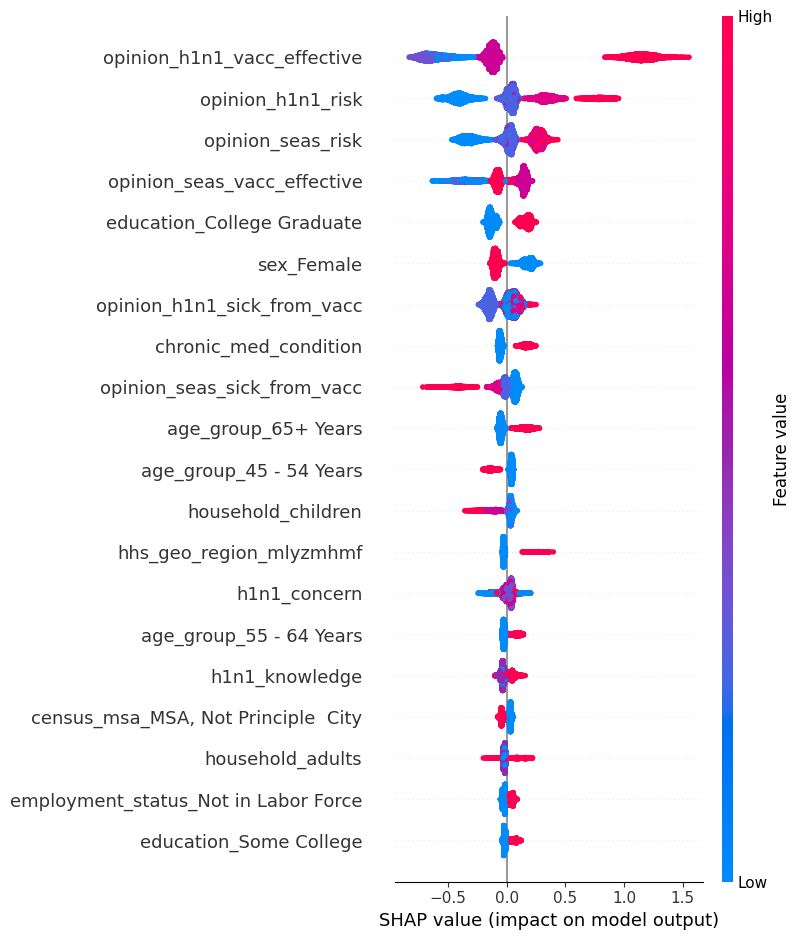
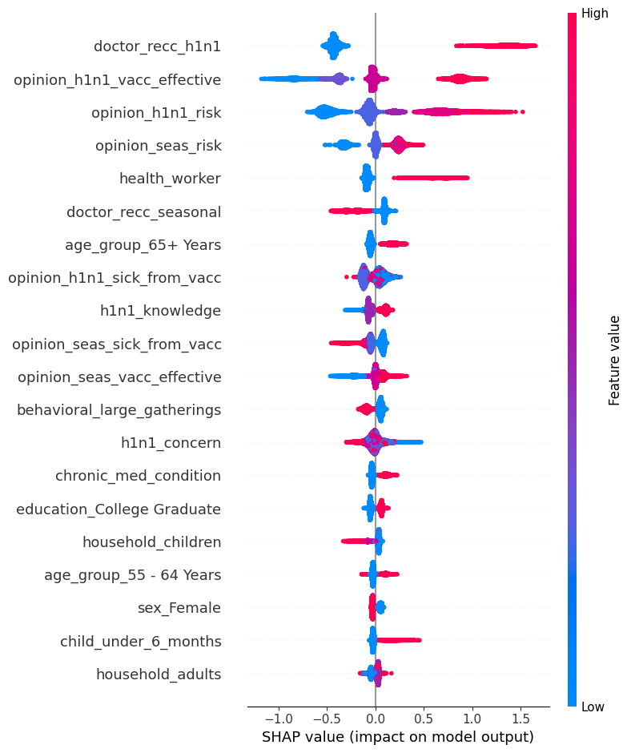

# Vaccination Prediction Project

This project aims to predict whether an individual will receive the H1N1 or seasonal flu vaccine based on social, demographic, and health-related characteristics. The analysis leverages machine learning models and explores key factors influencing vaccination decisions.

## Problem Statement

Despite vaccine availability, a significant portion of the population remains unvaccinated for H1N1 and seasonal flu, which can lead to outbreaks and preventable health costs. We aim to address:

1. **Predictive Analysis**: Predict flu vaccination likelihood based on various factors.

2. **Identifying Key Factors**: Understand the factors influencing vaccination decisions to help improve outreach programs.

## Data Overview

- **Number of Observations**: 26,708

- **Number of Features**: 36 (initial), reduced to 31 after feature selection.

- **Target Variables**:
    - `h1n1_vaccine`: Whether the individual received the H1N1 vaccine.
    - `seasonal_vaccine`: Whether the individual received the seasonal flu vaccine.

## Pipeline

1. **Data Cleaning**: Handling missing values using **KNN Imputation**.

2. **Exploratory Data Analysis**: Examining numerical and categorical features.

3. **Feature Engineering**: Identifying multicollinearity and selecting features based on **Variance Inflation Factor (VIF)**.

4. **Model Training**: Training multiple machine learning models (Logistic Regression, Random Forest, XGBoost, etc.) using **GridSearchCV** to tune hyperparameters.

## Models Performance (AUC Score)

### H1N1 Vaccine:
| Model              | AUC (Train) | AUC (Test) |
|--------------------|-------------|------------|
| Logistic Regression| 0.83        | 0.822      |
| Random Forest      | 0.831       | 0.825      |
| XGBoost            | 0.836       | 0.831      |
| CatBoost           | 0.8358      | 0.8310     |

### Seasonal Vaccine:
| Model              | AUC (Train) | AUC (Test) |
|--------------------|-------------|------------|
| Logistic Regression| 0.845       | 0.849      |
| Random Forest      | 0.848       | 0.851      |
| XGBoost            | 0.853       | 0.8561     |
| CatBoost           | 0.8525      | 0.8567     |

## Feature Importance

## Summary

1. We applied advanced imputation techniques like **KNN Imputation** to handle missing data.

2. A set of models were trained, and the best-performing models were selected using **AUC** scores.

3. We identified key features that influence flu vaccination decisions, such as doctor recommendations and opinions on vaccine effectiveness.

For more details, check the full project on [GitHub](https://github.com/SuleimanovShakir/vaccination_prediction).

